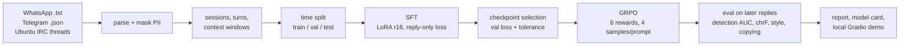

# EchoLM

[](https://github.com/swapnil5053/EchoLM/actions/workflows/ci.yml)

**Fine-tune a 1.5B language model to text like you, from your own WhatsApp and Telegram chats, on an 8 GB laptop GPU.** Benchmarked in public on one real person's replies rebuilt from the Ubuntu IRC logs, so the numbers below come from data anyone can download.

EchoLM turns a chat export into a time-split dataset, fine-tunes Qwen2.5-1.5B-Instruct with LoRA (SFT), then keeps training it with a from-scratch GRPO loop whose rewards target the failure SFT actually showed: collapsing onto a few stock replies. Every stage is measured on replies written *after* anything the model trained on, including a classifier that tries to tell the model's replies from yours.

Built for code-switched chat: romanized Hindi and English are treated as one vocabulary, with no language detection, lowercasing or filtering.



## Results

Public benchmark: one prolific #ubuntu helper, their 1:1 exchanges rebuilt from the public-domain [Ubuntu IRC logs](https://huggingface.co/datasets/common-pile/ubuntu_irc) (see [Public benchmark](#public-benchmark-ubuntu-irc)). Test replies are the latest 10% of sessions, written after everything the model trained on.

<!-- results:start -->
80 held-out test replies (later in time than all training data), 3 sampled replies each at temperature 0.8. † = also a GRPO reward on the training split.

| model | detect AUC ↓ | chrF ↑ † | style gap ↓ † | reply ppl ↓ | distinct ↑ | 6-gram copy ↓ † | chatbot ↓ † | median words |
|---|---|---|---|---|---|---|---|---|
| base | 0.965 ±0.010 | 0.171 (0.157–0.184) | 1.199 | 51.910 | 1.000 | 0.009 | 0.292 | 46.3333 |
| sft | 0.838 ±0.022 | 0.144 (0.134–0.154) | 0.237 | 19.710 | 0.992 | 0.000 | 0.009 | 19 |
| grpo | 0.829 ±0.032 | 0.141 (0.131–0.151) | 0.196 | 19.870 | 0.992 | 0.000 | 0.017 | 15 |
| your real replies | 0.588 | – | 0.000 | – | 0.988 | 0.000 | 0.000 | 11 |

- **detect AUC ↓**: cross-validated classifier telling your real replies from the model's; 0.5 = cannot tell them apart. Not optimized by any reward
- **chrF ↑ †**: character n-gram F-score against what you actually replied to the same message (95% bootstrap interval over prompts)
- **style gap ↓ †**: mean standardized difference from your real replies on 9 style features
- **reply ppl ↓**: perplexity of your real test replies under the model
- **distinct ↑**: share of unique replies; low means it falls back on stock replies
- **6-gram copy ↓ †**: share of 6+ word replies sharing a 6-word run with a training reply
- **chatbot ↓ †**: share of replies with assistant phrases ("I'm sorry, but" ...)
- **median words**: reply length

<!-- results:end -->

What the numbers say (one run; GRPO 200 steps, 2 h 40 min on an RTX 4060 Laptop GPU, 4 h 12 min end to end):

- **SFT does most of the work.** The classifier's ability to tell the model from the real person drops from 0.965 to 0.838 AUC, perplexity of the real replies falls 2.6x (51.9 → 19.7), assistant phrasing goes from 29% to 1%, and replies shrink from 46 to 19 words.
- **GRPO moves what it was rewarded for, and nothing else measurably.** Style gap improves a further 17% (0.237 → 0.196) and replies get closer to the real length (19 → 15 words, real 11), but both are rewards. On the metrics no reward touches, GRPO is level with SFT: detection AUC 0.829 ±0.032 vs 0.838 ±0.022, perplexity 19.9 vs 19.7. Its val reward dipped to 0.675 at step 100 and recovered to 0.777 by step 200, against 0.749 at step 0, a gap within sampling noise.
- **chrF favours long replies.** The untuned base model has the best chrF (0.171) because chrF weighs recall twice as much as precision, and 46-word answers cover more of the reference's character n-grams. That is why chrF is paired with a length reward in GRPO and never read alone.
- **No collapse on this data.** Unlike the private chat below, 99% of SFT replies are distinct: a support helper rarely repeats a stock line, so the duplicate and copy penalties never fired.
- **The gap left is large.** The model's replies are still told apart from the real ones at 0.83 AUC, against 0.59 for the person's own later vs earlier replies. The test set is 80 replies, so differences under a few hundredths are not meaningful.

<p align="center">
  
  
</p>

The GRPO run above used lr 1e-5 and one sampled reply per validation prompt, so its val curve mixes real change with sampling noise. The current config halves the learning rate, doubles the warmup and validates every checkpoint on the same random draws with two samples per prompt; `run.ps1 -Stages seeds` retrains GRPO with three seeds under it and adds a mean ± sd row to the table. Anyone can also judge the models blind: the demo's **Real or model?** tab shows the real reply next to a model's and logs how often you pick right, and the report adds that hit rate (50% = indistinguishable).

### On a private chat

The first run was on one private 1:1 Hinglish chat (813 training replies, 50 later test replies; only aggregate numbers are shown, the chat and model stay local). It shaped the design:

| model | style gap ↓ | reply ppl ↓ | chatbot ↓ | 6-gram copy ↓ | distinct ↑ | median words |
|---|---|---|---|---|---|---|
| base (Qwen2.5-1.5B-Instruct) | 1.133 | 323.9 | 0.633 | 0.000 | 0.787 | 18.3 |
| SFT, lowest val loss (step 100) | 0.345 | 79.4 | 0.000 | 0.188 | 0.287 | 3.3 |
| SFT, selected (step 80) | **0.313** | 80.0 | 0.000 | **0.018** | **0.373** | 6.7 |
| real replies | 0.000 | – | 0.000 | 0.000 | 0.960 | 3 |

- **SFT learns the style.** The model stops sounding like an assistant (63% → 0% assistant phrases), matches reply length, and the real replies become 4x more predictable to it.
- **The lowest val loss is not the best model.** From step 80 to 100 val loss improved by 2.6% while copying of training text went up 10x. EchoLM picks the earliest checkpoint within 3% of the best loss instead (`echolm train select`).
- **SFT collapses.** Only about a third of its replies are unique, against 96% of the real ones, and the training data is 95% unique, so it isn't repetition in the data. GRPO's rewards are built around that.

## How it works

### Data

A WhatsApp export is plain text in a locale-dependent format: day/month order is detected from the whole file, 12/24-hour clocks, iOS brackets and multi-line messages are handled, and invisible direction marks are stripped. Telegram JSON exports are read per chat, 1:1 only. URLs, emails, phone numbers and OTPs are masked in place; media, deleted and forwarded messages stay as placeholders so the turn structure survives.

A gap of more than 3 hours starts a new session (measured on the real chat: a quarter of replies come more than 30 minutes later). Consecutive messages from one person become one turn, joined by newlines, since texting in bursts is part of style. Each of your turns becomes a training window: up to 8 previous turns / 1500 characters as context, your turn as the target. Pasted walls of text are collapsed to `[long message]` and replies that only share a link are dropped. The last 10% of each chat's sessions is test and the 5% before that val, so evaluation is always on later messages.

### SFT

Qwen2.5-1.5B-Instruct in 4-bit with Unsloth, LoRA rank 16 on all attention and MLP projections, the plain transformers `Trainer` with labels built in code so only reply tokens carry loss. Every 20 steps it evaluates, saves, and prints sample replies next to the real ones. Rank 16 rather than 64: with ~800 windows a larger adapter mostly memorizes.

### GRPO, implemented from scratch

`echolm/rl` is a self-contained GRPO trainer (no TRL): for each prompt it samples 4 replies, scores them, and pushes the policy towards the replies that beat their group's average:

- advantage `A = (r − mean(group)) / std(group)`; groups where all 4 replies score the same carry no signal and are skipped;
- PPO-style clipped ratio, active when a batch is reused (`num_iterations > 1`);
- token-level loss normalization: every generated token weighs the same, whatever the reply length;
- **no KL term**. With LoRA, the frozen reference is the adapter-free *base* model, so a KL penalty would pull the policy back towards the chatbot SFT just trained away. Small clipped steps (lr 5e-6 after 20 warmup steps, grad norm 0.2) and the reward terms keep it near the SFT model instead;
- validation every 25 steps, including step 0 = the SFT model, on the same random draws for every checkpoint (2 samples per prompt): if GRPO never beats SFT on val reward, the final adapter *is* the SFT one.

The rewards (`echolm/rl/rewards.py`), each computed per sampled reply:

| reward | range | what it does |
|---|---|---|
| chrF to your real reply | 0..1 | character n-gram F-score (exact sacrebleu implementation) against what you actually replied to that message. A stock reply matches almost none of your replies, so it loses its group |
| style match | 0..1 | 9 style features (length, lines, emoji, casing, punctuation, elongation like "youuu"…) compared with *your reply to the same message*, not with an average reply, which would reward the most typical answer |
| length match | 0..1 | word-count ratio to your reply, log scale |
| duplicate | 0 / −1 | reply identical to another sample in its group |
| copy | 0 / −1 | shares a 6-word run with a different training reply (memorization) |
| chatbot, empty | 0 / −1 | assistant phrases, empty replies |

### Evaluation

Every model answers the same later-in-time test prompts, 3 samples each at temperature 0.8 (greedy decoding hides collapse). Metrics:

- **detect AUC**: a character n-gram classifier, cross-validated, tries to tell your real test replies from the model's. 0.5 = indistinguishable. No reward optimizes it. The "your real replies" row pits your later replies against your earlier ones, the realistic floor since your own style drifts.
- **chrF** with a 95% bootstrap interval over prompts, **style gap**, **perplexity** of your real replies, **distinct** replies, **6-gram copy**, **assistant phrases**.
- Columns marked † in the report are also GRPO rewards (on the training split), and are read with that in mind.

### Public benchmark: Ubuntu IRC

IRC is one big room, not a set of 1:1 chats, so `echolm/irc` rebuilds them. For a chosen nick, each line is attached to the one person it talks to, or dropped:

- **addressed**: the line starts with `nick:` or `nick,` for someone seen in the channel that day;
- **answer**: the first unprefixed line after being addressed, within a minute;
- **continuation**: an unprefixed line right after the speaker's own attached line, within a minute.

Bots and `!commands` are removed. Every partner becomes a separate 1:1 chat, the nick is renamed "Alex" and partners `user0001`…, and the result is written as a Telegram export, so the rest of the pipeline runs unchanged. Because the export is hundreds of short chats, the split is global by time (`configs/irc.yaml`) instead of per chat.

The rules were checked against human reply annotations ([irc-disentanglement](https://github.com/jkkummerfeld/irc-disentanglement), Kummerfeld et al., ACL 2019; the one-minute window was chosen on the dev split, numbers are from the test split):

| rules | precision | recall of reply links |
|---|---|---|
| addressed only | 0.964 | 0.449 |
| addressed + answer + continuation | 0.933 | 0.646 |

Precision = share of attached lines whose annotated parent is the chosen partner, or the speaker's own line in the same exchange. Two of the ten test logs are left out: their labels are shifted by 6 and 3 lines against the raw text in the public repository (unshifted, even `nick:` lines score 0.32 and 0.39; shifted, at least 0.81 and 0.88). With them included, precision is 0.807.

## Run it

### Synthetic demo data (any OS, no GPU)

```bash
pip install -e ".[dev]"
echolm parse examples/synthetic/whatsapp_rohan.txt --me Kabir
echolm parse examples/synthetic/telegram_meera.json --me Kabir
echolm format
pytest
```

Two fictional Hinglish chats (`echolm synth` regenerates them); `examples/synthetic/processed/` has the expected output.

### Your chats (Windows, NVIDIA GPU, Python 3.12)

Export a chat (WhatsApp on the phone: chat → More → Export chat → Without media; Telegram Desktop: Export chat history → JSON) into `exports/`, plug in the charger, close other GPU apps, then:

```powershell
powershell -ExecutionPolicy Bypass -File scripts\run.ps1 -Me "your name as it appears in the export"
.venv\Scripts\echolm demo
```

`run.ps1` installs a CUDA build of torch, Unsloth and the rest into `.venv`, rebuilds the dataset, trains SFT (reusing a finished run unless `-RetrainSft`), selects the checkpoint, runs GRPO, evaluates base / SFT / GRPO, writes `outputs/eval/report.md` and writes a model card into the GRPO adapter. Each training stage runs a short smoke test first and falls back to a slower path if the fast one fails on Windows. `-Stages grpo,eval,card` runs a subset.

### Public benchmark (Windows, NVIDIA GPU)

```powershell
powershell -ExecutionPolicy Bypass -File scripts\run.ps1 -Dataset ubuntu
.venv\Scripts\echolm demo --outputs outputs/ubuntu --data data/ubuntu/processed
```

This streams the 6 GB dataset once and keeps the `#ubuntu` logs since 2016 (`-Channel`, `-Since` to change), lists the most active nicks, picks the top one (`-IrcUser NICK` for another), keeps their most recent threads up to 2000 of their lines, checks the thread rebuilding against the annotations, and then runs the same stages as above under `data/ubuntu` and `outputs/ubuntu`. Only this run writes into the README table; a run on your own chats keeps its report in `outputs/eval`.

The demo opens a local page (bound to 127.0.0.1, never shared) where you play the other person, switch between the base, SFT and GRPO models, compare all three on one message, or play **Real or model?**: pick the real reply out of a blind pair. `--guess-only` starts just the game from the saved eval samples, without loading a model.

| command | what it does |
|---|---|
| `echolm irc fetch / users / export` | download a channel's IRC logs, rank nicks, write one nick's 1:1 threads as an export |
| `echolm irc validate --data DIR` | score thread rebuilding against human reply labels |
| `echolm parse EXPORT --me NAME` | parse one export into cleaned messages |
| `echolm format` | windows, time split, SFT / GRPO / test files, `stats.json` |
| `echolm train check` | GPU, packages, data, disk and W&B preflight |
| `echolm train sft [--max-steps N] [--resume RUN]` | SFT |
| `echolm train select` | print the SFT checkpoint GRPO starts from |
| `echolm train grpo [--init ADAPTER] [--backend hf]` | GRPO |
| `echolm eval run --model base\|ADAPTER --name NAME` | sample and score one model |
| `echolm eval report [--readme README.md]` | comparison table |
| `echolm eval plot --outputs DIR` | SFT val-loss and GRPO val-reward curves as SVG |
| `echolm card [--irc]` | model card for the newest GRPO run |
| `echolm push` | upload the Ubuntu IRC adapter and card to the Hugging Face Hub (refuses adapters trained on private chats) |
| `echolm demo [--guess-only]` | local chat UI and the blind real-or-model game |

Every run writes a `run_info.json` (config, data hashes, git commit, val history, peak VRAM, runtime) and a `train.log`. W&B logging falls back to offline mode when you are not logged in, and sample text never goes to W&B unless `wandb_samples: true`.

## Project layout

```
echolm/
  parse/     WhatsApp and Telegram parsers
  irc/       Ubuntu IRC: download, thread rebuilding, validation, export
  data/      cleaning, windows, time split, export, synthetic data
  train/     SFT (Unsloth + Trainer), checkpoint selection, preflight, Windows runtime helpers
  rl/        GRPO: rewards, chrF, rollouts, loss, training loop, W&B tracker
  eval/      sampling, detection AUC, style, copying, report
  demo/      Gradio app with adapter switching and the real-or-model game
  card.py    model card
  hub.py     Hugging Face upload, public benchmark adapters only
configs/     default.yaml and irc.yaml (data), sft.yaml, grpo.yaml, eval.yaml
scripts/     run.ps1
docs/adr/    design decisions and the evidence behind them
tests/       one test file per module; the SFT, GRPO, eval and demo paths run end to end on CPU with a tiny model
```

## Privacy

Real exports, processed data, adapters, generations and W&B sample tables stay out of git (`.gitignore`), and nothing is uploaded unless you log in to W&B, which then receives metrics only. `echolm push` only accepts an adapter whose model card names the public IRC dataset. A model trained on a real chat has read the other person's messages too: keep it private. The repository ships only synthetic data, and the published results come from public-domain IRC logs.

## Development

```bash
pip install -e ".[dev,eval,demo]"
pytest
ruff check .
```

The end-to-end tests (SFT data path, GRPO loop, eval sampling, demo) build a tiny random Qwen2 model on the fly and run on CPU in seconds; they need torch, transformers and peft and are skipped without them. GitHub Actions runs lint and the full suite on Windows for every push.

EchoLM was inspired by WeClone; see [ATTRIBUTION.md](ATTRIBUTION.md). Design decisions and the measurements behind them: [docs/adr/0001-architecture.md](docs/adr/0001-architecture.md).
